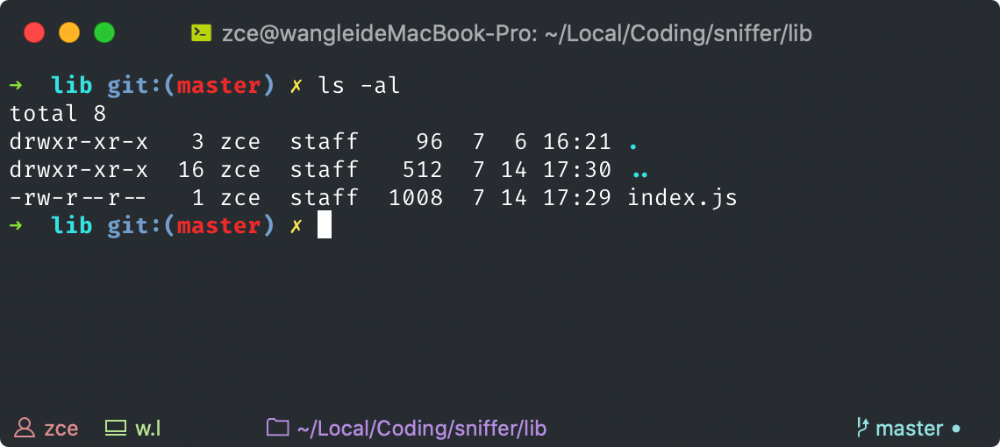
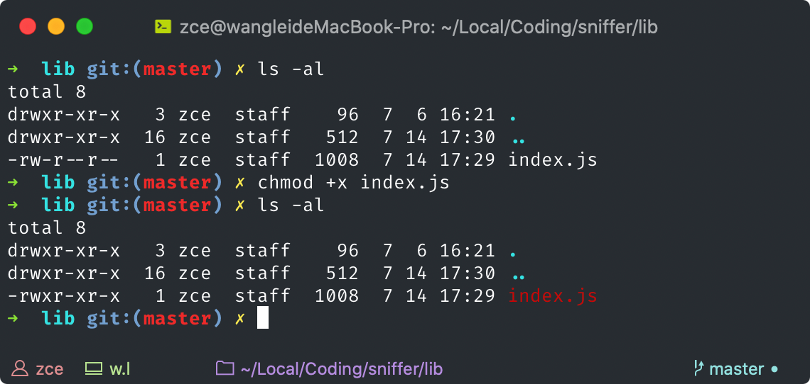
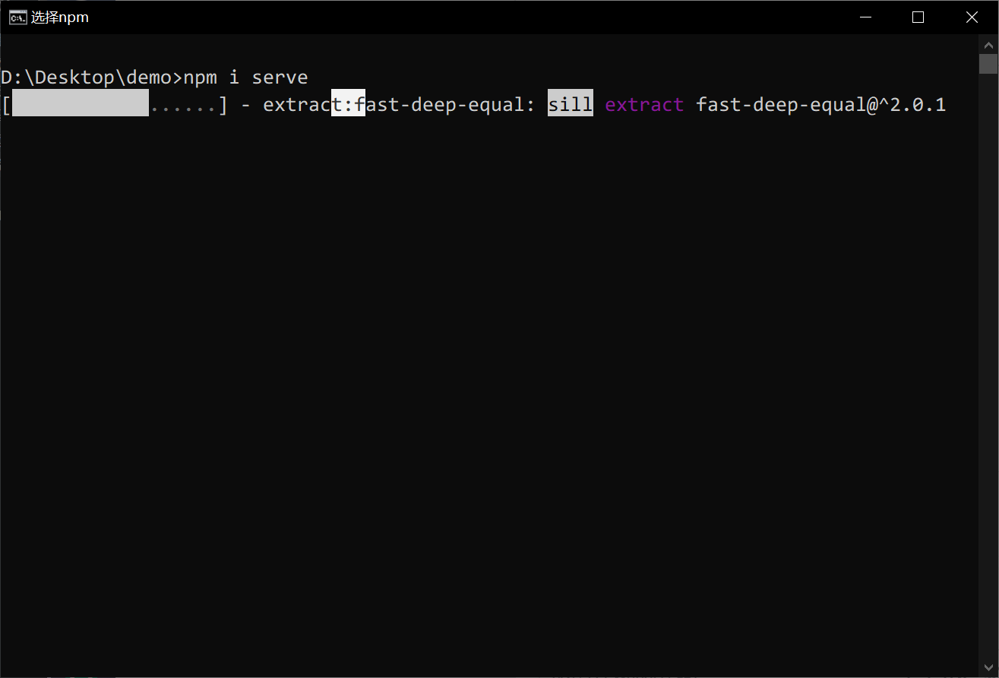

# 直播课：20200810 

## 一、Yeoman 之类的工具到底有啥用？

### Yeoman 之类工具的定位

1. vue-cli 或者 create-react-app 创建出来的都是适用于绝大部分项目的基础结构，所以生成的结构往往是极简的（不包含基础代码的）
   1. 只是针对特定框架类型的项目
   2. 对于实际业务项目开发来说，生成的项目结构过于简单
2. 而很多时候我们在同一个公司的不同项目中还有很多基础设施都是相同的，例如 axios 的包装、路由鉴权等，所以也应该放进脚手架模版中
3. 这种情况下，很多公司或团队就会选择开发自己的脚手架工具，以符合自身需要

### 常用实践

- 基于 Yeoman 写 Generator
  - Yeoman 是一个脚手架平台
- 自己造轮子
  - metalsmith / majo
  - 基于模版的脚手架工具
  - https://github.com/zce/caz

---

## 二、Gulp vs. Webpack

- Gulp 不具备任何具体功能，完全自主，自定义性强
  - Tasks Runner
  - 需要开发者自己实现各种功能
  - 对 Node.js 储备要求高
  - 强调任务的概念，Gulp 本身实际上是一个任务调度工具（tasks runner）
  - 通俗点说：Gulp 就是你想干什么就干什么～
- Webpack 从模块打包出发，通过插件实现一部分 Web 项目的自动化任务
  - 模块化打包功能开箱即用，相对门槛更低
  - 主要应对 SPA 类应用的模块打包

因为近几年 Webpack 的插件生态很好，

以往我们使用 Gulp 去实现的常用自动化工作现在都可以使用 Webpack 配合插件实现

让开发者产生二者「类似」这个误会的原因：Webpack 一直在突破边界。

### Gulp 常见场景

- 如果只是传统的静态页面开发（多页应用），注重的是页面结构与样式，建议采用 Gulp
- 小程序项目中使用 Sass / Less / TS，Gulp
- 再者就是日常的综合事务：文件重命名 / 前后缀
- 可以取代：批处理/shell

### 最佳实践

- 工具层面没有唯一标准答案
- 充分掌握 Gulp 与 Webpack，因地制宜
- SPA 类使用 Webpack
- MPA 类使用 Gulp
- 如果只是个别的需求直接使用 npm scripts 配合个别工具就好
  - 例如：只需要校验代码，单独使用 ESLint 的 CLI 就可以
  - npm scripts 就是小型 tasks runner

```json
{
  "scripts": {
    "clean": "rimraf lib",
    "lint": "eslint \"**/*.ts\"",
    "compile": "tsc --project .",
    "build": "run-s clean lint compile",
    "test:unit": "jest src",
    "test:integration": "jest test",
    "test": "run-s test:*",
    "coverage": "jest --coverage",
    "preship": "run-s build test",
    "ship": "npm publish --registry https://registry.npmjs.org"
  },
}
```

https://npmjs.com/npm-run-all

每一个 script 都可以有 prexxx  postxxx 钩子，例如 build：

prebuild → build → postbuild

---

## 三、近期常见问题

### npm or yarn

前端包管理工具

yarn.lock / package-lock.json

yarn / npx

- yarn 可以自动找到 node_modules/.bin 下的可执行文件，npx 也可以
  - yarn create <generator-name>  => create-<generator-name>
- npx 可以直接执行 远端（线上）模块，一次性使用

### 全局安装 or 本地安装

全局安装模块：只有本地经常用到，而且**与某一个特定项目无关**的工具或者模块

脚手架类型的工具，建议使用 npx / yarn create，一次性使用

其他所有的模块都应该安装到项目本地。也就是在 package.json 声明这个依赖，便于后期管理

很多 CLI 模块是跟着项目走的

### 全局安装模块 cli 找不到的问题

```shell
$ npm config get prefix # 获取 npm 全局目录
$ npm bin --global
$ yarn config get prefix
$ yarn global bin
```

解决办法：先找到你这个模块具体安装到哪了，然后确保这个路径出现在 PATH

执行一个命令：

1. 先去找当前 cwd 中有没有这样一个可执行文件
2. 如果找到了就直接执行这个文件
3. 找不到就会读取环境变量当中的 PATH
4. 以此去找 PATH 中配置的每一个路径
5. 找不到报错

Windows

- CMD：set PATH
- PowerShell：$env: PATH
- where xxx 找到这个命令所在的路径

Linux

- echo $PATH
- which xxx 找到这个命令所在的路径

### `yarn <cli-name>` / `npx <cli-name>`

Node CLI 类型的模块都会提供了一个或多个 CLI 程序，所以本地安装完这些过后，在项目的 node_modules 下的 .bin 目录里就会多出一个或者多个可执行文件。后续我们可以直接通过命令去使用这个 CLI 程序。

当然了，通过前面的介绍你应该了解过，对于 node_modules 下 .bin 目录里的可执行文件，我们可以通过 npx 或者 yarn 命令快速找到，不必使用完整的路径去访问。

那如果你使用的是 yarn，你就可以直接执行 `yarn <cli-name>`，这样的话 yarn 会自动找到 bin 目录下的 `<cli-name>` 文件。

我这里使用的是 npm 工具，所以我需要使用 `npx <cli-name>`。注意这里是 npx 命令，而不是 npm。

npx 是 npm 最新版本中集成的一个工具，也就是说你只要安装了最新版的 npm 工具，你就可以直接使用 npx 命令。

### `yarn link` / `npm link`

### Node.js CLI 程序的权限问题

CLI 程序在 Linux 下要求执行入口文件必须具备执行权。



添加执行权的方式如下：

```shell
# cli.js 是 package.json 中 bin 字段指向的文件
$ chmod 755 cli.js
$ chmod +x cli.js
```




http://c.biancheng.net/view/757.html

### 控制台卡死问题



只要左上角的标题栏变成选择 xxx，这个时候就像是截图一样，cmd 会停留在快照状态

### npm 安装模块超时 / 连接错误

```ini
# mirror config
sharp_dist_base_url = https://npm.taobao.org/mirrors/sharp-libvips/v8.9.1/
profiler_binary_host_mirror = https://npm.taobao.org/mirrors/node-inspector/
fse_binary_host_mirror = https://npm.taobao.org/mirrors/fsevents
node_sqlite3_binary_host_mirror = https://npm.taobao.org/mirrors
sqlite3_binary_host_mirror = https://npm.taobao.org/mirrors
sqlite3_binary_site = https://npm.taobao.org/mirrors/sqlite3
sass_binary_site = https://npm.taobao.org/mirrors/node-sass
electron_mirror = https://npm.taobao.org/mirrors/electron/
puppeteer_download_host = https://npm.taobao.org/mirrors
chromedriver_cdnurl = https://npm.taobao.org/mirrors/chromedriver
operadriver_cdnurl = https://npm.taobao.org/mirrors/operadriver
phantomjs_cdnurl = https://npm.taobao.org/mirrors/phantomjs
python_mirror = https://npm.taobao.org/mirrors/python
registry = https://registry.npm.taobao.org/
disturl = https://npm.taobao.org/dist
```

## 四、补充内容

### 命令执行过程

不管是 Windows 还是 Linux 下，除了 echo 这样的内置命令，执行其他任何命令都是最终找到一个可执行文件去执行。

路径查找规则：

1. 先在当前命令行所在目录（CWD）中查找
2. 然后依次去找 PATH 变量中的每一个路径


### Windows 环境变量配置


### macOS 环境变量配置

.bashrc  .bash_profile .zshrc

```shell
## load nvm
export NVM_DIR=$HOME/.nvm
[ -s $(brew --prefix nvm)/nvm.sh ] && . $(brew --prefix nvm)/nvm.sh
[ -s $(brew --prefix nvm)/bash_completion ] && . $(brew --prefix nvm)/bash_completion

## yarn global path
export PATH=$(yarn global bin):$PATH

## export mirrors
export NODEJS_ORG_MIRROR=http://npm.taobao.org/mirrors/node
# export IOJS_ORG_MIRROR=http://npm.taobao.org/mirrors/iojs
export NVM_NODEJS_ORG_MIRROR=$NODEJS_ORG_MIRROR
# export NVM_IOJS_ORG_MIRROR=$IOJS_ORG_MIRROR
```

### 开发一个 CLI 工具

- https://github.com/zce/m2i
- https://github.com/zce/caz

