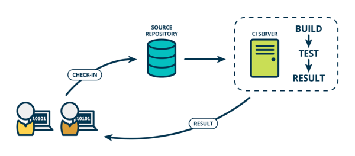

# FED-E-003 · Part2 - 1 问题收集

## 使用 grunt, gulp 搭建项目的自动化构建流程时，是否支持*.vue文件，如果支持，该如何配置。

首先，这个需求是可以实现的，但是目前市面上并没有这种插件（成熟的）。而且也没人这么做。

因为目前 .vue 这种单文件组件大都以模块化的方式组织的，而 Gulp 这类工具实现构建任务时，并不会特殊处理模块化的组织。如果只是把 .vue 这种单文件组件构建为单个的 JS 文件，构建后的 JS 还是零散的。还是需要模块化打包。

所以对于这类问题更好的方案仍然是基于模块化的打包工具：Webpack / Rollup 之类。

## 拆解一下 @vue/cli, create-react-app, @angular/cli 内部实现。

这类脚手架内部一般分为两大块：

- 一块用于生成项目基础结构所需要的文件
- 另一块用于封装一系列构建工具（Webpack 等）
    - 开箱即用
    - 因对变化（配置文件或者基础代码）

以 @vue/cli 和 create-react-app 为例：

- http://github.com/vuejs/vue-cli
- https://github.com/facebook/create-react-app

monorepo: 把一系列相关的模块发放到同一个仓库中维护，这种类型的仓库就叫做 monorepo

## grunt 如何实现打开浏览器随后监听 watch 任务

https://www.npmjs.com/package/grunt-browser-sync

```javascript
const sass = require('sass')
const path = require('path')
const loadGruntTasks = require('load-grunt-tasks')
const data = {
    menus: [{
            name: 'Home',
            icon: 'aperture',
            link: 'index.html'
        },
        {
            name: 'Features',
            link: 'features.html'
        },
        {
            name: 'About',
            link: 'about.html'
        },
        {
            name: 'Contact',
            link: '#',
            children: [{
                    name: 'Twitter',
                    link: 'https://twitter.com/w_zce'
                },
                {
                    name: 'About',
                    link: 'https://weibo.com/zceme'
                },
                {
                    name: 'divider'
                },
                {
                    name: 'About',
                    link: 'https://github.com/zce'
                }
            ]
        }
    ],
    pkg: require('./package.json'),
    date: new Date()
}
console.log(__dirname)
module.exports = grunt => {
    loadGruntTasks(grunt)
    grunt.initConfig({
        // 编译js
        babel: {
            // 定义配置文件
            options: {
                presets: ['@babel/preset-env'],
                // 开启sourceMap文件
                sourceMap: true
            },
            // 定义个目标
            main: {
                expand: true,
                cwd: 'src',
                src: ['assets/scripts/*.js'],
                dest: 'temp/'
            }
        },
        // 编译sass
        sass: {
            options: {
                implementation: sass,
                sourceMap: true
            },
            // 定义个目标
            main: {
                expand: true,
                cwd: 'src',
                src: ['assets/styles/*.scss'],
                dest: 'temp/',
                ext: '.css'
            }
        },
        watch: {
            scripts: {
                files: ['src/assets/scripts/*.js'],
                tasks: ['eslint', 'babel'],
            },
            scss: {
                files: ['src/assets/styles/*.scss'],
                tasks: ['scsslint', 'sass'],
            },
            pages: {
                files: ['src/**/*.html'],
                tasks: ['swig'],
            },
        },
        clean: {
            dev: ['temp'],
            build: ['dist']
        },
        // 图片压缩
        imagemin: {
            options: {
                optimizationLevel: 7,
                pngquant: true
            },
            main: {
                files: [{
                    expand: true,
                    src: ['src/assets/images/*.{png,jpg,jpeg,gif,webp,svg}'],
                    dest: 'dist/'
                }]
            },
            fonts: {
                files: [{
                    expand: true,
                    src: ['src/assets/fonts/*.{png,jpg,jpeg,gif,webp,svg}'],
                    dest: 'dist/'
                }, ]
            },
        },
        concat: {
            js: {
                src: [
                    'dist/assets/scripts/**/*.js',
                    'node_modules/bootstrap/**/*.js'
                ],
                dest: 'dist/assets/scripts/vendor.js'
            },
            css: {
                src: [
                    'dist/assets/styles/*.css',
                    'node_modules/bootstrap/**/*.css'
                ],
                dest: 'dist/assets/styles/vendor.css'
            }
        },
        copy: {
            fonts: {
                files: [{
                    expand: true,
                    src: ['src/assets/fonts/*'],
                    dest: 'dist/'
                }]
            },
            extra: {
                files: [{
                    expand: true,
                    cwd: "public",
                    src: ['*'],
                    dest: 'dist/'
                }, ]
            },
            build: {
                files: [{
                    expand: true,
                    cwd: "temp",
                    src: ['**/*'],
                    dest: 'dist'
                }],
            }
        },
        swig: {
            swig: {
                options: {
                    data
                },
                expand: true,
                dest: 'temp/',
                cwd: 'src',
                src: ['*.html'],
                ext: '.html'
            },
        },
        browserSync: {
            bsFiles: {
                src: 'temp/**/*'
            },
            options: {
                watchTask: true,
                notify: false,
                // 端口
                port: 6001,
                // 不默认打开
                open: false,
                // 服务设置
                server: {
                    // 运行文件夹
                    baseDir: ['temp', 'src', 'public'],
                    // 配置映射，routes 高于 baseDir
                    routes: {
                        // 将 /node_modules 映射到工程下的node_modules
                        '/node_modules': 'node_modules'
                    },
                    keepalive: false
                }
            }
        },
        eslint: {
            target: ['src/assets/scripts/*.js']
        },
        scsslint: {
            allFiles: [
                'src/assets/styles/*.scss',
            ],
            options: {
                bundleExec: true,
                colorizeOutput: true
            },
        },
        useref: {
            html: 'dist/**/*.html',
            temp: 'dist'
        }
    })
    grunt.registerTask('build', ['clean:build', 'copy:build', 'useref', 'babel', 'concat', 'uglify', 'cssmin'])
    grunt.registerTask('compile', ['babel', 'sass', 'swig'])
    grunt.registerTask('server', ['browserSync', 'watch'])
    grunt.registerTask('start', ['clean:dev', 'compile', 'server'])
    grunt.registerTask('lint', ['eslint', 'scsslint'])
    // 如果任务名称为default 那么yarn grunt 会默认执行
    // grunt.registerTask('start', ['babel', 'copy', 'imagemin','swig'])
    // grunt.registerTask('build', ['babel', 'copy', 'imagemin','swig'])
}
```

## 自动化部署怎么实现？

自动化部署在后期的项目里面会单独介绍，包括不同种类的项目如何部署。

这里介绍一个 gh-pages 的插件，可以用来部署静态网页类的应用。

```javascript
const deploy = () => {
  return gulp.src('**', { cwd: config.dest })
    .pipe($.ghPages({
      cacheDir: `${config.temp}/publish`,
      branch: 'gh-pages'
    }))
}
```

现阶段很多时候会不会在构建任务中定义部署任务，而是结合到 CI 的工作流里面去。



```groovy
pipeline {
  agent any
  stages {
    stage('检出') {
      steps {
        checkout([
          $class: 'GitSCM',
          branches: [[name: env.GIT_BUILD_REF]],
          userRemoteConfigs: [[
            url: env.GIT_REPO_URL,
            credentialsId: env.CREDENTIALS_ID
          ]]
        ])
      }
    }
    stage('安装') {
      steps {
        sh 'yarn install'
      }
    }
    stage('构建') {
      steps {
        sh 'yarn build --production'
      }
    }
    stage('部署') {
      steps {
        sh 'npx gh-pages -d dist'
      }
    }
  }
}
```

## 构建监听文件变化是怎么实现的？事件回调还是轮询检查？

Node.js `fs.watch` or `fs.watchFile`

https://www.npmjs.com/package/chokidar

## 我是18年开始做前端，一进来就是前后端分离，webpack。对grunt，gulp等这些工具使用场景不太熟，能不能按时间详细讲讲前端开发，打包发布演变历史。

主要代表时代：

动态网页：ASP、PHP、JSP 时代；前端所有的资源来源于后端应用的执行结果，这种状态下，前端是后端的附属品，也是被驱动的，没有太大的发挥空间；而且业务上的要求也不会特别复杂。说白了，前端代码不会特别复杂。

一句话总结：业务上的问题越来越多，表象上越来越简单，黑盒子越来越大

## 工程化视频里讲了在目标路径下生成自己的模板脚手架，如果我想在目标目录下运行自定义命令，比如运行一段自定义命令，在目标目录下直接下载依赖和启动项目，如何实现？

npm 模块：https://www.npmjs.com/package/execa

原生 API：https://nodejs.org/dist/latest/docs/api/child_process.html#child_process_child_process_spawn_command_args_options

## 自己封装脚手架和npm命令行工具那里有点过于简单了，能不能再做一些拓展？

可以先参考：https://github.com/zce/caz

这个下一次加餐，我们集中说。

## yarn link 直接运行报"不是内部命令"或“Error: Cannot find module”，但link后使用yo 运行子集生成器没问题，是什么原因呢？

单独补充

## 本地 测试 生产环境接口地址配置，怎么通过写配置文件方式打包，像webpack一样

https://www.npmjs.com/package/gulp-replace

https://www.npmjs.com/package/gulp-env-vars