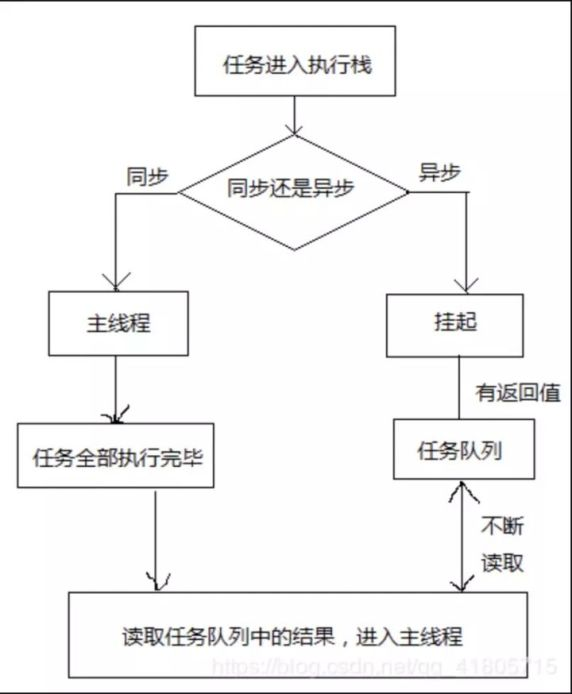
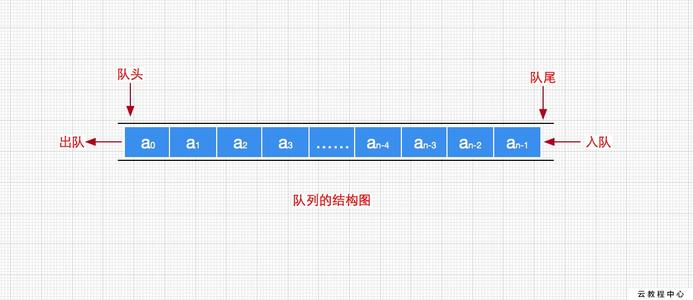

# 作业：1-1，JS异步编程

## 1. 如何理解JS异步编程?
#### 1.1 什么是异步编程?

javascript语言的一大特点就是**单线程**，在某个特定的时刻只有特定的代码能够被执行，并阻塞其它的代码，也就是说，同一个时间只能做一件事。比如: 
```javascript
console.log("1")
console.log("2")
console.log("3")
// 依次自上而下输出1,2,3
```
但是当某一步骤响应时间比较长，则会出现程序“假死”的情况，很大程度上降低了执行速度，效率低，响应时间长. 比如: 
```javascript
console.log("1")
console.log("2")
const start = new Date()
while(new Date() - start < 1000000) {}
console.log("3")
// 输出1,2后, 程序将阻塞在while循环, 等待相当长的时间后,才会输出3
```

将所要执行的函数放到任务队列中，不占用主线程，只有等主线程执行完毕之后，才通知请求执行任务，从而将任务从任务队列进入到主线程中执行。这样一个机制就是`异步编程`。

#### 1.2 怎么做到异步编程？
通过回调函数的形式。将之后要执行的函数放到任务队列。

直到nodejs的出现，开始将回调模式的异步编程机制发挥的淋漓尽致，这种机制开始在前端变得非常流行。

但是慢慢也体现出了回调函数在错误处理和嵌套上的副作用。

因而, 异步解决方案一直在发展中, 大致历程为: callback => 事件发布\订阅模式=> Promise => Generator => async/await => rx => .....。

发展的特点是, 将异步编程的代码表达尽量地贴合自然语言的线性思维。
## 2. 如何理解EventLoop?
EventLoop，顾名思义为：事件循环，是指浏览器一种解决JS单线程运行时的一种机制。

javascript上， 所有同步任务都在主线程上执行，也可以理解为存在一个“**执行栈**”。

- 主线程外，还有一个“**任务队列**”，任务队列的作用，就在等待异步任务的结果，只要异步任务有了运行结果，通过回调函数的形式将所要执行的函数放到任务队列中，不占用主线程。

- 一旦**执行栈**中所有同步任务执行完毕，就从 **任务队列** 中读取“任务”加入到“执行栈”中。

- 主线程不断的在循环上面的步骤。


线程从任务队列中读取事件，这个过程是不断循环的，所以整个运行机制被称为event loop,如图所示: 



## 3. 如何理解消息队列?
消息队列，一般我们会简称它为MQ（Message Queue），就是很直白的简写.


***消息***（Message）是指在应用之间传送的数据，消息可以非常简单，比如只包含文本字符串，也可以更复杂，可能包含嵌入对象。

***队列*** 是一种先进先出的数据结构, 栈、堆、消息队列是一种数据结构，队列，特点为先进先出，存放执行的任务



**消息队列可以简单理解为**: 把要传输的数据放在队列中，例如：生产者将数据放入消息队列中，然后消费者从队列中依次取队列中的消息


## 4. 如何理解宏任务和微任务?
任务分为：宏任务和微任务
宏任务：消息队列中的每个任务都是宏任务，
微任务：每个宏任务对应都有一个微任务队列.

普通任务队列和延迟队列中的任务，都属于**宏任务**。

对于每个宏任务而言，其内部都有一个微任务队列。那为什么要引入微任务？微任务在什么时候执行呢？

其实引入微任务的初衷是为了解决异步回调的问题。想一想，对于异步回调的处理，有多少种方式？总结起来有两点:

1. 将异步回调进行宏任务队列的入队操作。
2. 将异步回调放到当前宏任务的末尾。

如果采用第一种方式，那么执行回调的时机应该是在前面所有的宏任务完成之后，倘若现在的任务队列非常长，那么回调迟迟得不到执行，造成应用卡顿。

为了规避这样的问题，V8 引入了第二种方式，这就是**微任务**的解决方式。在每一个宏任务中定义一个微任务队列。

执行栈在完成同步任务之后，会去执行任务队列中的宏任务，当该宏任务执行完成，会检查其中的微任务队列

如果为空则直接执行下一个宏任务，如果不为空，则会按照先进先出的规则全部执行完对应的微任务，执行完成才去执行下一个宏任务。如此循环，直至任务结束。

因此, 微任务主要解决任务优先级的问题和单个任务执行过长的问题。


常见的微任务有MutationObserver、Promise.then(或.reject) 以及以 Promise 为基础开发的其他技术(比如fetch API), 还包括 V8 的垃圾回收过程。
