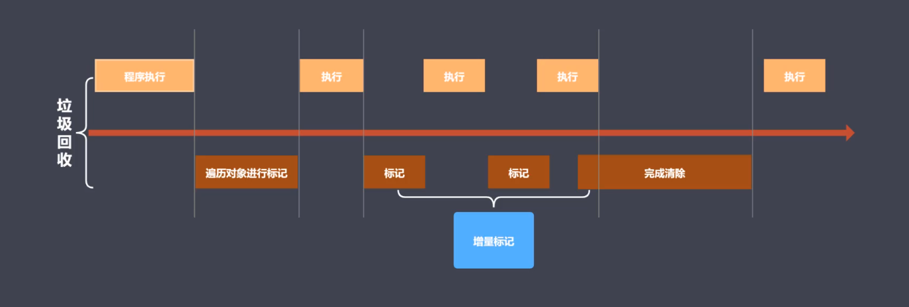

# 作业：1-2，ES新特性与TypeScript、JS性能优化

## 简答题
### 一、请说出下列最终的执行结果，并解释为什么。
```JavaScript
  var a = []
  for (var i = 0; i < 10; i++) {
    a[i] = function() {
      console.log(i)
    }
  }

  a[6]()
```

***解答如下***: 

输出10，循环执行的过程，给数组a每个位置均定义了一个函数，每个函数各自独立，但功能一模一样。
for循环条件语句内定义的变量i，实质上是全局作用域内的变量，因此循环提结束运行后，变量i值变为10.

当 `a[6]()` 执行的时候，实际上执行了函数`function() {console.log(i)}`,执行的过程中，在函数作用域内没有发现变量i，继续向上一级也就是全局作用域查找，发现i，此时i经过循环，现值为10，因此最终打印出10。

### 二、请说出下列最终的执行结果，并解释为什么。
```JavaScript
  var tmp = 123
  if (true) {
    console.log(tmp)
    let tmp
  }
```

***解答如下***: 

报出引用错误，在初始化之前不能访问 'tmp'。

因为在if语句块中定义了局部变量`let tmp`， 因此该语句块内部（{}），从开始到，声明`let tmp`处，
对于变量`tmp`，会形成`暂时性死区`，无法访问tmp，因而报错。

ES6明确规定，如果区块中存在let和const命令，这个区块对这些命令声明的变量，从一开始就形成了封闭作用域。凡是在声明之前就使用这些变量，就会报错。

### 三、结合ES6新语法，用最简单的方式找出数组中的最小值
```JavaScript
  var arr = [12, 34, 32, 89, 4]
```

***解答如下***:

首先，无论如何，数组都至少遍历一遍，是个O(n)的算法。那就是找形式上看起来最简便的方法，如下：
```JavaScript
  // 书写形式最简便的：
  const min = Math.min(...arr)

  // 其他的手动遍历的：
  const min2 = arr.reduce((a, b) => a < b ? a : b)

  const min3 = arr.sort((a, b) => a - b)[0]
```

### 四、请详细说明var，let，const三种声明变量的方式之间的具体差别。

***解答如下***:

1. var：
    * ES6之前声明变量的方式，没有块级作用域的概念，只有全局变量和函数作用域变量。
    * 存在变量提升现象。
    * 可以先使用后声明,此时在赋值位置之前使用会返回undefined。
    * 同一个变量可以重复使用var关键词进行定义。

2. let:
    * ES6新增的声明块级作用域变量的方式，定义let变量的区域（{}范围）形成块级作用域，该变量仅在此作用域内有效。
    * let不存在变量提升现象
    * 在块级作用域内部，直到声明语句之前，形成变量的暂时性死区，此时不能访问该变量。
    * let定义的变量必须要先声明然后再使用。
    * 同个作用域里，使用let不能重复声明变量

3. const：
    * const类似于let，是声明常量使用的,
    * 声明变量必须赋初始值，且之后不能再被更改。
    * 声明一个引用类型数据的常量，可以修改这个常量上的属性。只是不能修改常量本身的值（引用地址）

### 五、请说出下列代码最终输出的结果，并解释为什么。
```JavaScript
  var a = 10
  var obj = {
    a: 20,
    fn() {
      setTimeout(() => {
        console.log(this.a)
      })
    }
  }

  obj.fn()
```

***解答如下***:

输出：20，当执行`obj.fn()`,因为fn函数是一个普通函数，由obj对象调用。因此，此时fn函数的执行上下文（this）指向obj对象。fn执行过程中，设置了一个定时器，该定时器定义了一个回调函数，这个回调函数是个箭头函数，没有自己的this，因此this指向声明时所处环境的this。也就是fn函数的this。综上，定时器内部回调函数的this在fn执行的时候指向obj，因此，this.a也就是obj.a。输出20。


### 六、简述Symbol类型的用途。

***解答如下***:

在ES5中，对象属性名都是字符串容易造成属性名冲突。为了避免这种情况的发生，ES6引入了一种新的原始数据类型Symbol，表示独一无二的值。

因而，利用这个特性，对以下场景可使用Symbol：
1. 不需要对外操作和访问的属性使用Symbol来定义。
2. 使用Symbol来替代常量。
3. 使用Symbol定义类的私有属性/方法，使得实例上访问不到symbol属性。
4. 注册和获取全局Symbol，Symbol不光在单个window中是唯一的，在多个相关window间也是唯一的。
5. iterator迭代器使用Symbol定义

### 七、说说什么是浅拷贝，什么是深拷贝？

***解答如下***:

浅拷贝（shallowCopy）和 深拷贝（deepCopy），最根本的区别在于是否真正获取一个对象的复制实体，而不是引用

浅拷贝，是字面量的复制，复制的仅仅是引用对象所在的内存地址，浅拷贝只是增加了一个指针指向已存在的内存地址，因此，效果上还是指向同一个对象，对原有变量更改的时候，会影响现有对象的值。

深拷贝，就是为了解决引用对象复制问题的。在复制引用对象的时候，创建新的内存空间，拷贝对象的具体内容，将原有对象的属性遍历复制到新的对象上。复制的结果是一个新的对象，变量所存放的该引用对象的地址也是全新的。其内容地址是自助分配的,拷贝结束之后,内存中的值是完全相同的,但是内存地址是不一样的,两个对象之间相互不影响,也互不干涉。

浅拷贝的方法：遍历对象属性赋值，Object.assign()，展开运算符...

深拷贝的方法：浅拷贝+递归，JSON.parse(JSON.stringify(obj))，lodash方法。

JSON.parse(JSON.stringify())这个方法有一定的局限性，序列化时遇到如下情况需要注意：
* 时间对象 => 字符串的形式
* RegExp,Error => {}
* 会丢失 function,undefined
* NaN,Infinity,-Infinity => null
* 如果对象中存在循环引用的情况也无法实现深拷贝

### 八、请简述TypeScript与JavaScript之间的关系。

***解答如下***:

简而言之，TypeScript是JavaScript的超集。

在实现了原有JavaScript所有API的基础上，扩展了类型系统。

JavaScript是一门动态类型弱类型的语言。在执行的时候才会确定变量的类型。无需编译，直接能在浏览器引擎和node环境中直接运行。

TypeScript是一门静态类型强类型的语言。方便了静态检查。需要编译为js后才能运行。

### 九、请谈谈你所认为的TypeScript优缺点。

***解答如下***:

TypeScript优点：

1. 使用 TS 新特性开发项目，项目代码的健壮性增强，代码错误更早暴露。
2. 编辑器支持情况良好，比如：VSCode，有很多智能提示，编码更准确，提升开发效率。
3. 使用 TS 的强类型特性来开发项目，可以使得项目代码重构更牢靠。
4. 使用 TS 的强类型特性来编写代码，可以减少很多不必要的类型判断。
5. TS 最终会被编译为 JS 运行，可以将 ES6+ 编译为ES5/ES3，兼容性好。
6. TS 是渐进式的，完全可以使用 JS 编写代码，可以将新特性慢慢应用到项目中。

TypeScript缺点：

1. 引入了很多概念和新语法，有一定学习成本。
2. 在项目较小，不需要以后的维护，并且没有多人协同开发的情况下，不够灵活，需要额外编写声明文件，做出类型限制。增加了额外的工作量。
3. 网上资料相对js来说要少，查找一些开发问题的解决办法较为困难。

### 十、描述引用计数的工作原理和优缺点。

***解答如下***:

**工作原理**：

核心思想是在内部通过一个`引用计数器`来维护一个当前对象的引用数。通过设置引用数，判断当前引用数是否为0，引用关系改变的时候会修改引用数字，引用数字变为0立即回收。

**优点**：

1. 发现垃圾的时候可以及时回收垃圾对象。
2. 最大限度减少程序暂停。时刻监控引用为0的对象，会立即释放，不会使程序达到内存上限。

**缺点**：
1. 无法回收循环引用对象
2. 时间开销大，当前引用计数器维护一个数值变化，时刻监控是否需要修改，会有额外开销。

### 十一、描述标记整理算法的工作流程。

***解答如下***:

标记整理可以看做是标记清除的增强操作。算法不直接对可回收对象进行清理，而是让所有可用的对象都向一端移动。然后直接清理掉边界以外的内存。

分为两个阶段，`标记阶段`和`整理清除阶段`。

**标记阶段**：遍历并标记活动对象，将其记录为可达对象。

**整理清除阶段**: 通过数次搜索堆内存，从头到尾进行线性的遍历，如果发现某个对象没有标记为可达对象，通过读取对象信息，则将对象的地址进行移动，重新装填活动对象，使其在地址上连续，然后再回收。

### 十二、描述V8中新生代存储区垃圾回收的流程。

***解答如下***:

V8采用分代回收的思想。分为新生代和老生代，分别采用不同的算法。

新生代回收过程采用复制算法+标记整理算法，新生代内存区被分为两个等大小的空间，一个是使用空间From，另一个为空闲空间To，活动对象存储于From空间，标记整理后将活动对象`拷贝`到To，From与To交换空间完成释放，`拷贝`过程中有可能出现晋升。

**晋升**: 晋升就是将新生代对象移动至老生代。晋升的触发条件有两条：一轮GC后还存活的新生代活动对象，或者To空间使用率超过25%。

### 十三、描述增量标记算法在何时使用及工作原理。

***解答如下***:

**使用时机**：老生代的对象回收时候，为了对效率进行优化(对比新生代区域的复制算法来说)，会采用增量标记算法。

**工作原理**: 垃圾回收的时候，实际上是会阻塞js主线程的执行，为了减缓这种阻塞的感觉，将遍历对象进行标记的`标记`这个操作，拆分为多个阶段，微观上使标记与程序主线程交替进行执行，宏观上就是并发执行，使程序主线程运行更流畅。过程如图所示：

